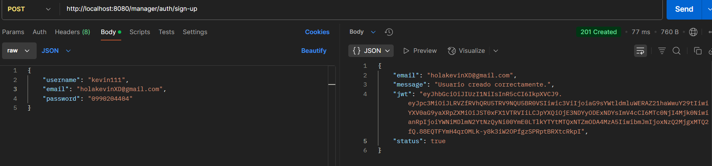
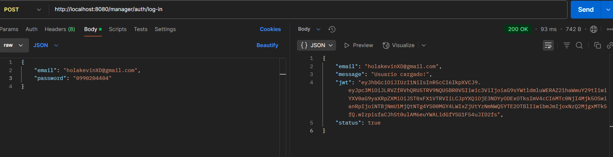
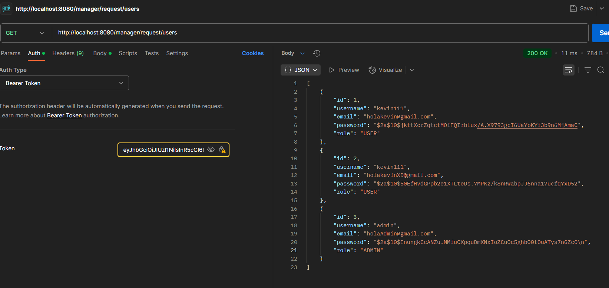
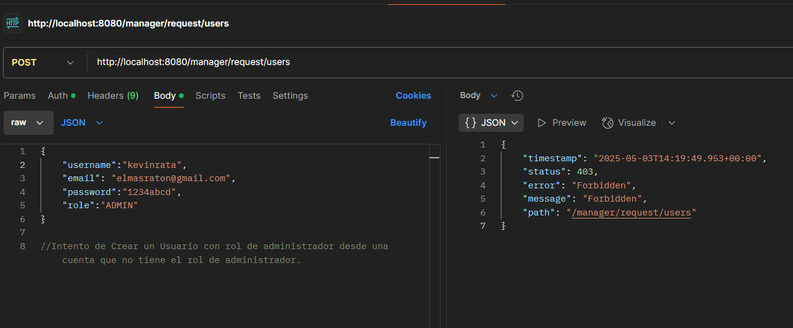
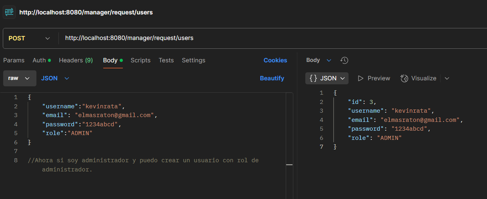
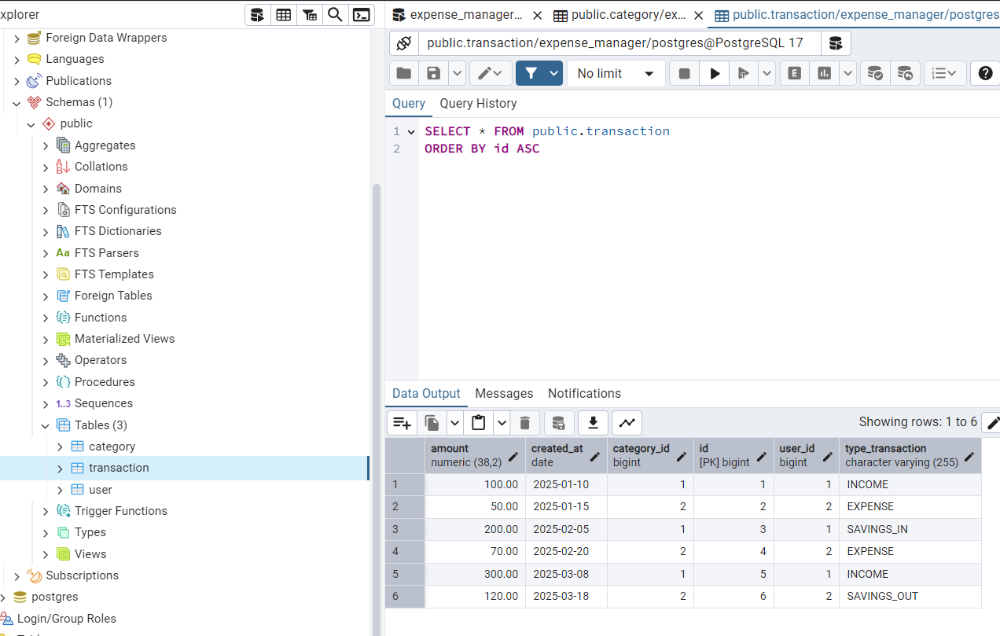
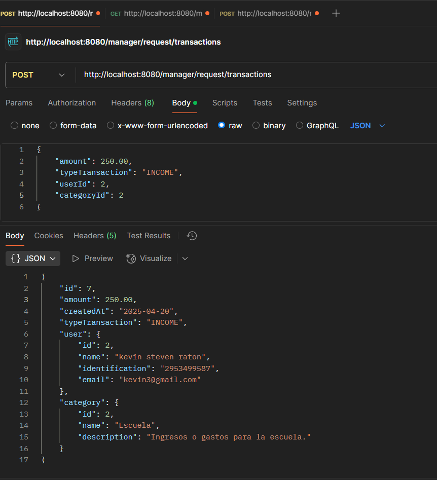
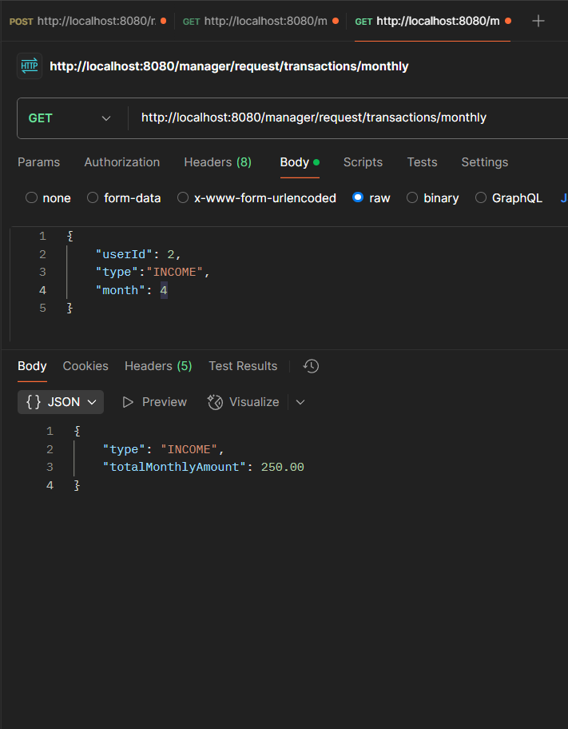
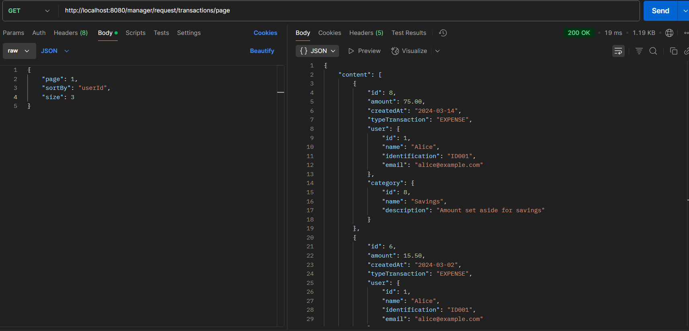
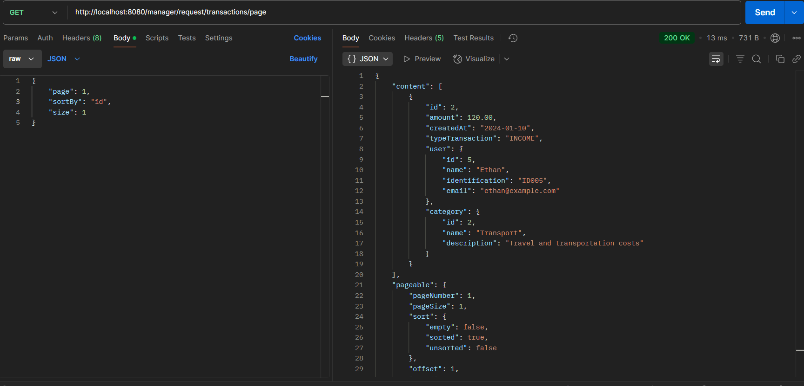

# 📊 Sistema de Control de Gastos Personales

**Proyecto para gestionar los gastos personales, ingresos, saldos y categorías.**

Este sistema permite a los usuarios registrar sus transacciones, clasificarlas en categorías y obtener un resumen mensual de sus finanzas.

## 🚀 Tecnologías Usadas

- **Backend**: Spring Boot
- **Base de Datos**: PostgresSQL para la gestion de base de datos
- **Otras**: Java, JPA, Hibernate, RESTful APIs

## 🔧 Requisitos

- Java 17 o superior
- Maven para gestionar dependencias
- PostgresSQL para la gestion de base de datos


## 📝 Entidades

### 🧑‍💻 **User** (Usuario)

| Atributo       | Tipo         | Descripción                           |
|----------------|--------------|---------------------------------------|
| `id`           | `Long`       | Identificador único del usuario.     |
| `name`         | `String`     | Nombre completo del usuario.         |
| `identification`| `String`    | Identificación (Ej. DNI, Cédula).    |

### 💸 **Transaction** (Transacción)

| Atributo      | Tipo            | Descripción                                |
|---------------|-----------------|--------------------------------------------|
| `id`          | `Long`          | Identificador único de la transacción.    |
| `monto`       | `Double`        | Monto de la transacción.                  |
| `fecha`       | `LocalDate`     | Fecha de la transacción.                  |
| `t_type`      | `TransactionType`| Tipo de transacción (Ingreso, Gasto, Ahorro). |
| `u`           | `User`          | Usuario asociado a la transacción.        |
| `c`           | `Category`      | Categoría de la transacción.              |

### 🏷 **Category** (Categoría)

| Atributo      | Tipo          | Descripción                             |
|---------------|---------------|-----------------------------------------|
| `name`        | `String`      | Nombre de la categoría (Ej. Alimentación, Entretenimiento). |
| `description` | `String`      | Descripción de la categoría.            |

### 📊 **TransactionType** (Tipo de Transacción)

- `INCOME`: Ingreso
- `EXPENSE`: Gasto
- `SAVINGS_IN`: Ahorro (Ingreso)
- `SAVINGS_OUT`: Ahorro (Salida)

## 📈 Resumen Mensual

Para obtener un resumen de tus gastos e ingresos del mes.
### En proceso 🏗️
### `GET /manager/request/transactions/monthly` 

Este endpoint devuelve un resumen del mes con los totales de **ingresos**, **gastos** y **ahorros**.

## 🛠 Instalación

1. Clona el repositorio:
    ```bash
    git clone https://github.com/SoyKevin111/expense-manager-back.git
    ```

2. Accede al directorio del proyecto:
    ```bash
    cd sistema-control-gastos
    ```

3. Ejecuta el proyecto con Spring Boot:
    ```bash
    ./mvnw spring-boot:run
    ```


## 🚀 Avances

### 🔐 Autenticación

#### 📝 Registro de Usuario


#### 🔑 Inicio de Sesión


#### 🔒 Acceso a Recursos Protegidos


#### ⛔ Crear Usuario con Rol No Autorizado
> Solo un administrador puede asignar roles diferentes de `USER`.


#### ✅ Crear Usuario con Rol de ADMIN


---

### 📡 Endpoints API

<div align="center">

<table>
  <tr>
    <td></td>
    <td></td>
  </tr>
  <tr>
    <td></td>
    <td></td>
  </tr>
  <tr>
    <td colspan="2" align="center">
      <br/>
      
    </td>
  </tr>
</table>

</div>


#### ver mas resultados en: ``src/main/resources/assets/avances``